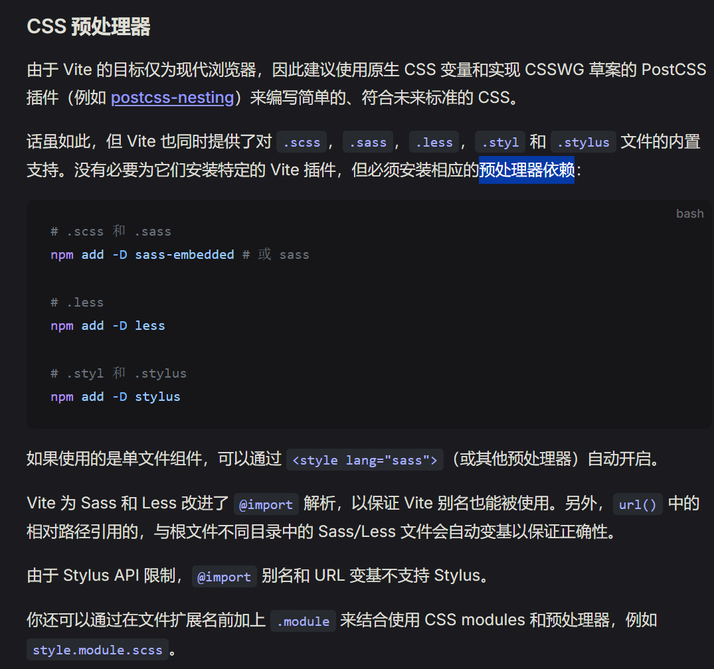

初学者在学习了`css`之后想看看别人的项目，发现大家基本上都用`sass`写了~打开官网看了介绍后发现还是可以把这个理解为`css`的超集，基本用法是兼容`css`的，遂写一个系列博客文章总结用法，作为学习记录同时做出些具有正外部性的内容产出。

<!-- more -->

## `sass`是什么？为什么一般见到的后缀是`.scss`？

> Sass is a stylesheet language that’s compiled to CSS.

这是官网的介绍。可以看到首先写的这个`sass`是要编译成`css`后再使用的。那为什么要用这个语言来写样式呢？

优点有（官网写的）：
- It allows you to use variables, nested rules, mixins, functions...
- All with a fully CSS-compatible syntax

我们知道`css`写起来很多东西很重复，一层叠一层，就像它的名字“层叠样式表（Cascading Style Sheets，缩写为 CSS）”一样，有时候写了很长后一直出bug，仔细一看前面不小心设了好多个父级的`position`:sleeping:。而`sass`的名称是`Syntactically Awesome Stylesheets`，是一个“哇塞的语法样式”，通过嵌套、变量、函数、继承等偏向于脚本语言的设置，让整体编写更简洁。

### `sass`和`scss`这俩是什么关系？

继续上官网文档说法：

::: tip
Sass has two syntaxes! The SCSS syntax (.scss) is used most commonly. It’s a superset of CSS, which means all valid CSS is also valid SCSS. The indented syntax (.sass) is more unusual: it uses indentation rather than curly braces to nest statements, and newlines instead of semicolons to separate them. All our examples are available in both syntaxes.
:::

翻译过来就是说这个`sass`有两种语法：
- .scss:常用且是css的超集，完全兼容css的语法；
- .sass:不常用且不是花括号分号语法，是用缩进和换行写的；

**因此！总结下来，`sass`很强，用它的`scss`语法来写。**

## 如何安装与编译？

### 安装
看到官网那么多安装方法我也是晕了......说是提供两种类型的包。简单一下，虽然原生JS慢，但我的项目也小啊！:astonished:主打一个根据需求安装，所以直接通过`npm`安装到全局，结束！如果想用更快的，可以在官网了解。

::: tip
The `sass package` is pure JavaScript, which is a little slower but can be installed on all platforms Node.js supports. The `sass-embedded` package wraps a JS API around the `Dart VM`, so it’s faster but only supports Windows, Mac OS, and Linux.
:::

安装到全局：
```bash
npm install -g sass
```

### 编译

1. 最简单直接的编译方式（手动版）

```bash
sass input.scss output.css
```

2. 每次sass修改后自动编译（单个文件版）

```bash
sass --watch input.scss output.css
```

3. 监听整个文件夹，冒号分隔

```bash
sass --watch app/sass:public/stylesheets
```

#### 使用构建工具自动编译
每次都要这么设置，感觉还是挺麻烦的，尤其是你的样式表放置的位置比较分散。因此得了解下有啥更方便的。我用的开发IDE是`vscode`，构建工具目前只学到了`vite`，因此先去看看`vue3/vite`的官网怎么讲：

<Badge text="Bingo~" type="tip" />它说单文件组件直接支持，如果使用的是单文件组件，可以通过 `<style lang="scss">`（或其他预处理器）自动开启。只要下载了预处理器依赖（前面下载的就是）。



<font color='grey'>总体来看不难，但css一个月不写都快忘了。。。</font>


## 基础语法

### 1. 变量

当你有想重复使用的变量，例如背景颜色、字体大小等，可以设置为变量在多个地方重复使用。而且比如你想二次开发的时候，如果有这样已经设置好的变量直接取用就可以，能够很好保持样式的一致性。

用法是在前面加个`$`符号即可。
```scss
$theme-bg-color: #333;
body{
  background-color: $theme-bg-color;
}
```
当编译的时候，这个变量会自动替换为其保存的值。

### 2. 嵌套语法

我们知道`html`语法都是嵌套着来写的，这css非得搞个堆叠的。`scss`这里做了改进，支撑嵌套语法，这样就可以与`html`保持一致。其中`&`是很常用的符号，在`sass`官网中成为parent selector，通常结合伪类选择器使用，代表当前范围内的外部的选择器（注意父选择器与类型选择器的位置一样，只能放在前面，例如h1.title-content中的h1）。
```scss
nav{
  ul{
    list-style: none;
    margin: 0;
    padding: 0;
    li{
      display: inline-block;
      margin-right: 20px;
      a{
        text-decoration: none;
        color: #333;
        &:hover{
          color: #007BFF;
        }
      }
    }
  }
}
```

除了这种选择器结构的嵌套，`sass`支持属性的嵌套，比如`font`字体有size,family,weight...一系列属性，每次都要打出来很麻烦（虽然但是vscode自动联想挺快的）：

```scss
.content{
  font: {
    // 上面一定要有个空格啊，不然报错。
    // 哦对了sass还支持这种注释方式，但不会在css中显示
    /* 这种注释会显示 */
    size: 16px;
    family: Arial, sans-serif;
    weight: 400;
  }
}
```

### 3. 不编译的Partials

当你有些可以复用的scss代码，只是导入到其它`scss`中复用，自己本身不需要被编译为`css`使用，此时就可以这样命名文件`_partials.scss`，这样编译器就知道不用编译它了。使用方法是利用`scss`的`@use`语法，这里不做详细展开，下面的模块会讲。


### 4. 模块

如上文所言，当想要复用或者让代码结构更清晰而不是堆叠在一个文件中时（包括变量，Mixins以及函数时），可以引入模块。


创建模块：
```scss
//_base.scss
$primary-color: #3498db;
$secondary-color: #2ecc71;
```

使用：
```scss
@use "base";//不用下划线，也不用后缀（so smart）
.content{
  color:base.$primary-color;
  background-color: base.$secondary-color;
}
```

### 5. Mixins

不会翻译hhh，这个是用来复用一个样式，并且提供了灵活性，可以传入一些参数。比如你想显示几个不同颜色的卡片列表，就可以先把卡片的border，大小之类的都定义好，然后传入颜色参数就Ok啦！使用的方法是`@include`语法，相当于表示你要使用这个定义好的样式。

```scss
@mixin card($color:DarkGray){
  background-color: $color;
  border-radius: 5px;
  padding: 20px;
  box-shadow: 0 2px 5px rgba(0,0,0,0.1);
}
// 这里是一个使用了mixin的例子
.card-first{
  @include card(#3498db);
}
.card-second{
  @include card(#2ecc71);
}
.card-third{
  @include card(#e74c3c);
}
```

### 6. 继承

这个跟上面的不同的是，Mixins是创建模板，而这个是你看到别人的挺好看的，我直接说我要复刻下。语法是`@extend`。
```scss
.button-basic{
  background-color: #007BFF;
  color: #fff;
  padding: 10px 20px;
  border-radius: 5px;
}
.button-alert{
  @extend .button-basic;
  background-color: #dc3545;
}
.button-success{
  @extend .button-basic;
  background-color: #28a745;
}
```

### 7. 运算

支持运算，同时提供了`math`这个模块，内置了很多常量和计算函数。其中要注意的是，除法要用内置模块的`math.div()`，因为`/`容易起冲突。

```scss
@use "sass:math";

.container {
  display: flex;
}

article[role="main"] {
  width: math.div(600px, 960px) * 100%;
  // 转为比例
}

aside[role="complementary"] {
  width: math.div(300px, 960px) * 100%;
  margin-left: auto;
}
```