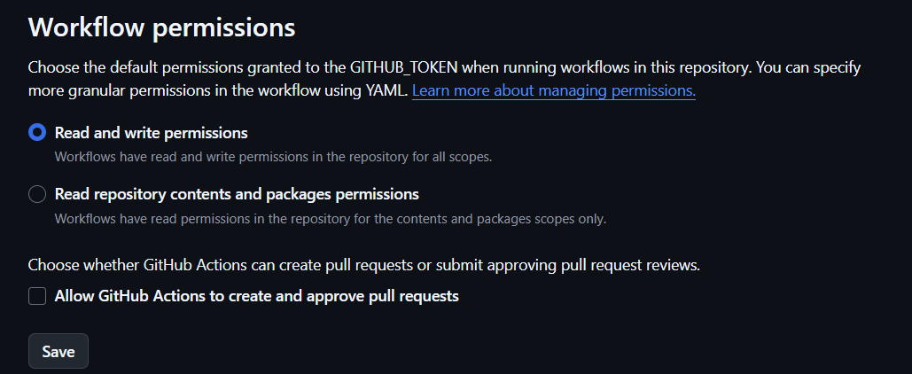

## Vuepress自动部署步骤
### 1. 生成工作流
创建模板时自动生成工作流`.github/workflows/deploy-docs.yml`，该文件中包含自动打包构建以及部署到github仓库的流程；

如果没有在刚开始创建好，可以根据`vuepress`官方提供的文档模仿着来写。[部署到github pages](https://vuejs.press/zh/guide/deployment.html)

### 2. 配置`.vuepress/config.ts`
1. 如果你准备发布到 https://*USERNAME*.github.io/ ，你可以省略这一步，因为 base 默认就是 "/"
2. 如果你准备发布到 https://*USERNAME*.github.io/*REPO*/ ，也就是说你的仓库地址是 https://github.com/*USERNAME*/*REPO* ，则将 base 设置为 "/*REPO*/"

### 3. git操作进行：
1. 初始化（optional），这一步在模板构建时也会帮忙完成，若没有选择，需要自己进行初始化；
2. `add .` 操作，存入暂存区；
3. 进行`commit`初步提交；
4. `git remote add origin repo.link`建立远程连接，其中origin是给仓库起的名称而已；
5. `git push -u origin main`将本地仓库的`main`分支`push`到远程，注意如果你的分支是`master`，需要进行额外的一步`git branch -M main`来重命名。这里的`push`操作就会自动触发`workflow`进行构建与部署到仓库的`gh-page`分支；
### 4. `github pages`设置
进入自己所在仓库的settings页面，选择左侧的pages，设置分支为`gh-page`点击保存后即可。

### 5. 常见bug排除：

::: caution 官网没说的github权限设置

同样是设置的左侧的Actions中的`general`，找到下面这一项关于工作流的许可设置，改为允许读写并保存。

:::

