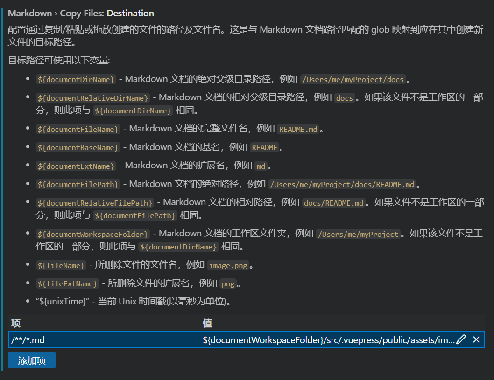

> 在`vscode`中编辑markdown文件时粘贴图片的位置默认在同级文件夹目录下，这样会导致markdown文件的目录结构变得非常混乱，不利于管理。这里可以简单对其粘贴位置做配置：

1. `ctrl+,`打开设置
2. 输入`markdown.copy`进入粘贴的配置设置
3. 如下图所示，键对应着选择所有的md文件，值对应着你准备设置的文件粘贴路径
  - `${documentWorkspaceFolder}` 工作区目录
  - `${documentBaseName}` markdown所在文件目录名
4. 设置中有很多目录的设置指导，可以根据自己的偏好设置~

