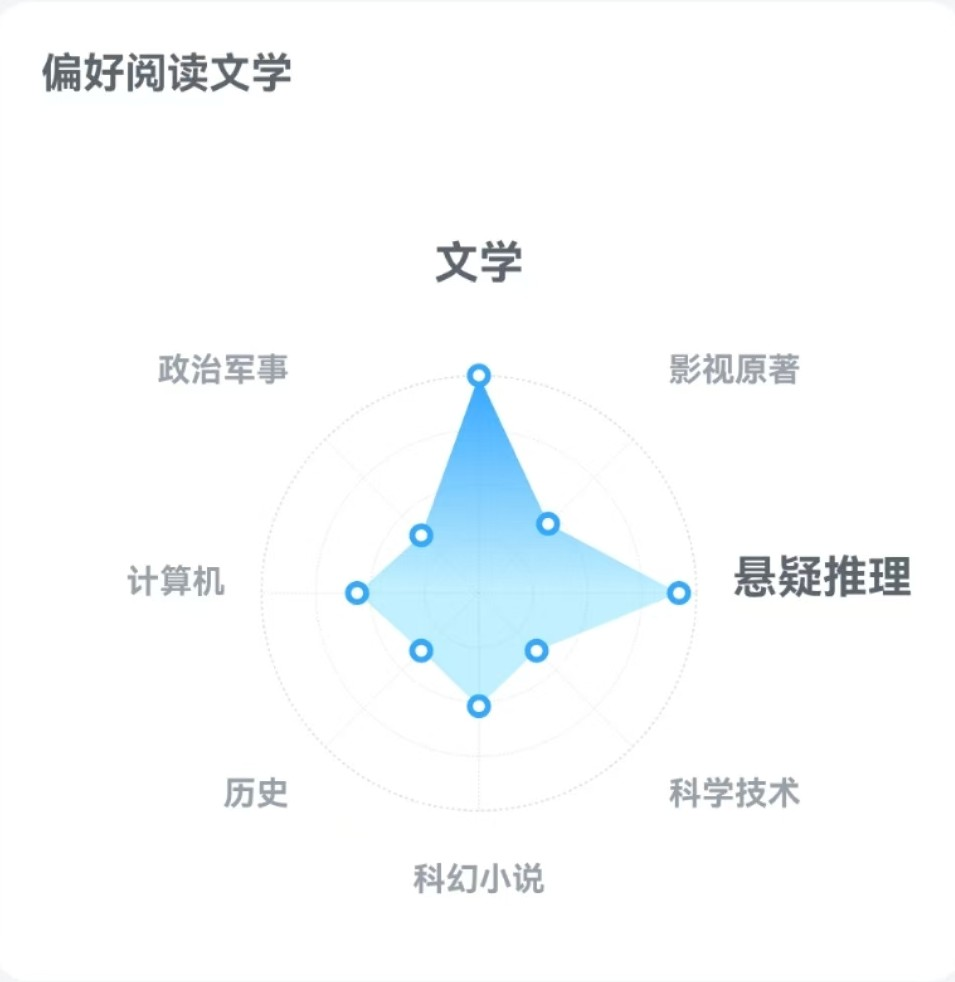

# 介绍页

::: note 注意

如果您是查看在线简历的，请点击这个[在线简历地址](/blog/resume.html)，此页仅作更加Personally的展示，感谢！

:::

我是一名正在读研的地理专业硕士研究生，日常在科研中就很喜欢“可视化”相关的内容，平时上网看到精美的页面也会由衷地赞叹和喜欢！在兴趣驱动下课余尝试自学了**前端**相关的知识，且未来有点想以**写代码**为发展目标。

不过未来到底要去做什么呢？我也说不准。人生是时势与个人选择造就的，我所能做的选择是“**从心所欲+顺势而为**”，在当下找到一个自己喜欢的能养活自己的事情，已经很棒啦！

## 比较喜欢社交的INTP
十六型人格测试一直是`INTP`，说这个性格很适合当**程序员**，确实作为一个内向理性的人能和代码逻辑打交道还是很幸福的！不过很神奇的是，可能我的`i`属性并不强烈，我还是比较喜欢和人交往聊天的，我是温暖的机器人:smiling_imp:。

> 猜测是因为这一点我才喜欢做前端的工作？思考中......既可以写逻辑，又可以与人进行交互打造更良好的体验。目标是成为全栈！

## 多多探索的运动爱好

很喜欢球类运动，会坚持跑步和健身。虽然都菜菜的，游泳只会蛙泳且仍然怕水，因此暂且认为还不会吧。球类小有天赋，尤其是小球，上手很快，据说“**挥拍运动**”是最长寿的运动，很享受击打那一刻的天然的快感~欢迎和我约球！

<HobbyCarousel/>

## 学习是一件趣事

属于应试教育中读书还不错的，始终觉得学习不是负担，而是属于比较享受的事情，~~考试竞争之类的事情除外~~。人生<Badge text="白日梦" type="tip" />有一件是“发财后满世界读书上学，学习各种无用的东西。”

不过自认为距离成为一个有着丰富文化底蕴和良好科学素养的人还存在一定距离。希望可以“读万卷书，行万里路”，成为一个有眼界有学识且平和谦逊的成年人。<Badge text="继续修炼中……" type="important" />

喜欢读小说，偏爱的类型是**推理**、**文学**，目前喜欢阿加莎·克里斯蒂、石黑一雄、萨拉·沃特斯……曾经的东叔狂热粉。社会学的书籍一直想涉猎，当作未来目标吧，目前读的社会学更偏向于大众科普读物，喜欢“**区域经济**”研究的话题。

一个部分的我的展示暂时到这里结束……

