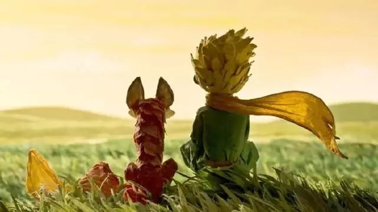

《奇风岁月》这本书我是慕名来读的，它与《麦田里的守望者》《杀死一只知更鸟》齐名，共同入选美国中学文学教材。作者在书的前言里写道：

> 《奇风岁月》写作的过程有如行云流水，那种感觉，好像不是我在写这个故事，而是故事自己在写，而我只是像个驾驶员一样，偶尔转动一下方向盘。

而我在读这本书的时候也是觉得酣畅淋漓。这本书的故事发生在二战后的美国南方一座安静的小镇——奇风镇，主角是十二岁的少年科里，他最亲的兄弟是一只叫“叛徒”的小狗；而他形影不离的伙伴，是一辆叫“火箭”的脚踏车。每到夏季开始的那一天，他总是骑着“火箭”，载着“叛徒”，带着那群朋友，飞到最高的天际。读完之后我也有一种给自己的自行车起个名字的冲动~

选择这本书最初是想来读一些推理故事。书籍一开头，是凛冽的还未破晓的冬季清晨，小男孩儿与自己的父亲在前去送牛奶的路上，一辆汽车突然从路口直冲进深不见底的萨克森湖，父亲跳下湖救人，却被骇人的尸体模样吓了一跳。与此同时主角科里看见了一个人站在树林中，地上掉落的绿色羽毛成为了唯一的线索。

绿色羽毛成为了贯穿全文的线索，春夏秋冬时节的更替，小镇陆陆续续发生了一系列故事，从主角少年的视角中，亲情、友情、死亡、写作、勇气、正义、善良、恶势力、种族偏见等主题交织呈现。这些故事和主题，虽然发生在一个遥远的时代和地点，但读起来并没有隔阂之感，毕竟人的感情是相通的。所有的大人都曾是小孩，但只有少数人记得。

《奇风岁月》描述的少年冒险与成长故事，让人不禁想起自己的童年时光。儿时去田地里冒险，与伙伴发现了人工湖，同样是在冬日，我们在结了冰的湖上小心翼翼地走路，这块地方也成为了我们的秘密基地。我的童年时光也爱读一些冒险故事，比如《查理九世》，我始终记得书籍扉页的这句话：

::: center

*在欢笑与泪水交织的人生旅途，*

*我们尽情活过每一个日子。*

*镜中的自己逐渐老去，*

*这本书献给那永远的孩子。*

:::
