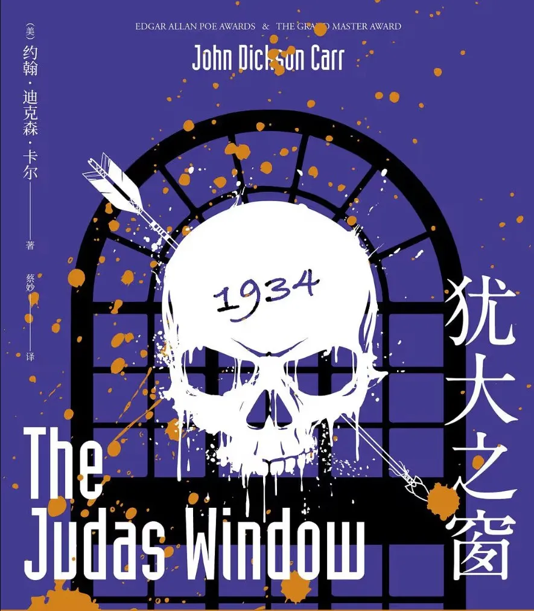
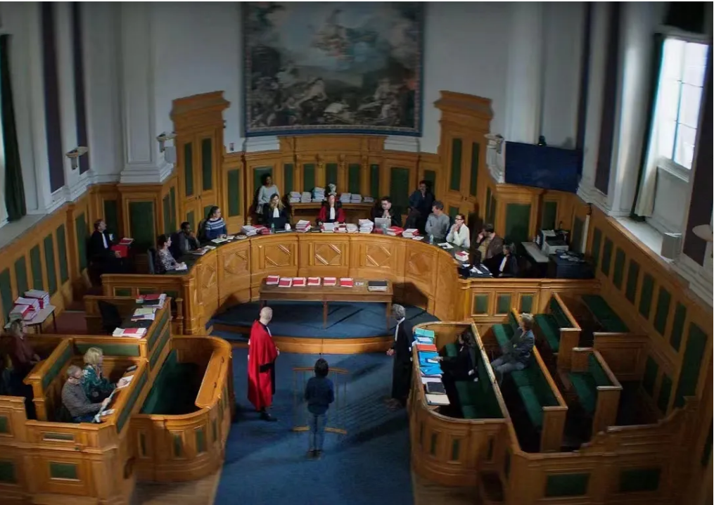
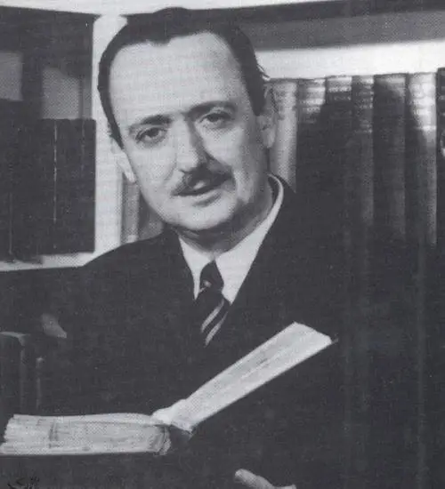

> 引子：每个房间都有一扇只有凶手才能看见的犹大之窗

一名男子到伦敦去拜访自己未来的岳父，到达后，岳父带他进入一间用金属百叶窗密封的书房，邀他共同饮酒。书房中摆放着岳父年轻时参加射箭比赛赢得的奖品——三支箭，两人在喝酒期间谈到了这些箭，这位准女婿还开了一个并不有趣的玩笑：“我又不是来偷东西或者杀人的，除非情况必要。”

一语成谶。半杯酒下肚后，女婿即我们的主角意识到自己被下了药，轰然倒地。等他迷糊醒过来后，却惊讶地发现岳父已经被箭射杀，而书房的门却从内拴上，自己成为了这次凶杀案的唯一嫌疑人......

::: warning

非常明显的密室案件！

:::

但本书并未从现场勘察的角度等常规的叙事方式切入，而是直接进入法庭审判环节，通过法庭的辩方和检方的证据出示、证人质询以及逻辑推演等环节，抽丝剥茧出案情的真相。

其中的证人质询环节高潮迭起，说谎被拆穿的证人、从检方证人变为辩方的证人、临时逃跑的证人……这些形形色色的心怀各异的人，也为这本书增加了悬疑的色彩。机械密室、精彩激烈的法庭对弈以及错综复杂的人物关系，共同构成了这部作品引人入胜的推理世界。

联想到了最近看的法国电影《坠落的审判》，是一部非常巧妙地将情节冲突融入到法庭场景中来的庭审电影（courtroom drama）。严格限定的场景和事件程序主导故事线稳步推进，而质询、抗辩等环节，能频频将故事推向高潮，同时庭审中犀利的措辞和对话，又能够深挖出人物心理的矛盾与冲突。实在是高超的叙述方式！

必须承认，法庭推理难以回避的一个问题是阅读起来会有一种啰嗦重复之感。但这种题材真的太适合反转了！一个细小的漏洞，就可以完全推翻上一个人所描述的所有逻辑和事实，再重新构建起属于自己的一套叙述。想来这也是这种题材推理小说的美妙之处吧！

最后安利法庭推理的经典电影《控方证人》，1952年版本的黑白电影仍然值得细细品味。如果喜欢游戏推理的，游戏《逆转裁判》即是这种模式，近些年的一部国产游戏《山河旅探》中的一些推理环节，同样运用到了法庭推理的套路。

**作者简介：**

约翰·迪克森·卡尔和阿加莎·克里斯蒂、埃勒里·奎因并称“推理黄金时代三大家”，独以密室题材构思见长，一生设计出五十余种不同类型的密室，被誉为“密室之王”。
