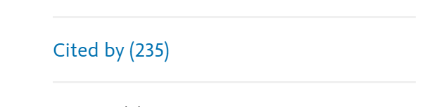

最近想在一篇别人2019年发的比较有新意的论文的基础上，做出自己的进一步创新。发现了爱斯维尔提供的一个“查找该文献被谁引用过”的功能很好用，遂有感而发，写一篇查找目标主题论文的思路总结。

<!-- more -->

> 综述大法好！一般综述提供了这个研究的相关术语（方便主题查找）、研究脉络、相关研究人员……可以对这个领域你所处的研究生态位（哈哈）有个快速的定位了解，也为之后更详细的检索打下基础。

## 根据主题检索

最直接的方法，就是搜索你想要研究的话题。我一般在 Google Scholar 上搜索。关键词尽量不要太长太具体，先搜大概的方向，再根据返回结果里的高被引文章、常见关键词调整检索策略。比如“energy transition”这个词，搜索之后就能看到有哪些人一直在做、有哪些研究路径、甚至有哪些模型或数据集反复出现。

## 根据作者检索

当你发现一篇比较好的文章的时候，可以去看看这篇文章的通讯作者或者一作，她/他的个人主页，一般一个课题组的研究兴趣是比较固定的，这样就可以扒一下这个课题组对于这个主题做的所有文章。

很多时候，一个课题组围绕一个方向连续发好几篇，有理论也有应用，有数据也有模型——这个时候就很适合做一个“小型综述”，把它们的脉络理一理。

## 根据参考文献检索（查看之前的研究脉络）

看看你读的这篇文章的前言或方法或数据来源，看它引用了哪些，你也可以根据这个来阅读。这种算是回溯性研究。尤其是方法部分，哪些模型、哪些数据、哪些定义是引用来的，一般都能追溯到这个研究领域早期或者关键的奠基文献，适合把基础补牢一点。

## 根据该文被引的文献（查看该文章的一些变体和研究演进）

这个是我最近发现的，实在是太棒啦。因为我看的这篇距离现在也有6年了，因此要是直接按照这个仿写？？？实在是落后了，一定要看看别人在它的基础上又创新性做了什么，然后再提出自己的创新。

这个功能在 Google Scholar、Web of Science、Elsevier 等平台上都可以找到，点开那篇文章之后找“Cited by”或者“被引文献”，就能看到后来者是怎么“站在巨人肩膀上”的。

有时候还能看到完全不同视角的延伸，比如原文关注的是城市层面，后来的文章可能把它应用到国家层面、做了跨国比较，或者结合了新的数据集和AI方法。
读这些文章的过程中，你可以不断问自己：我能不能把这些思路“拼”出一个更有趣的切口？有没有哪种角度是还没人尝试的？

## 总结
新手刚上路，还有很多需要学习的。目前暂时总结到这里，说不定这个还会出第二集~
